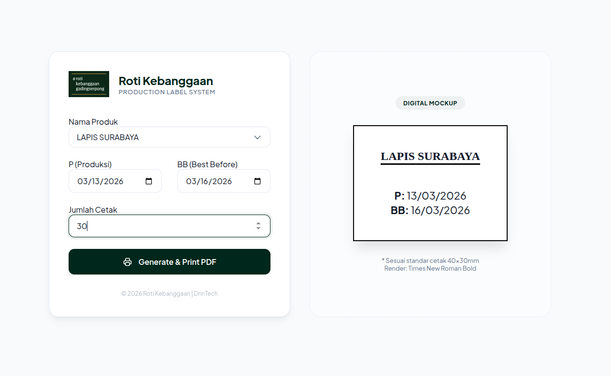

# Production Label System

Sistem web internal sederhana dan efisien untuk mencetak label produk manufaktur/dapur (ukuran custom **40mm x 30mm**). 
Dibangun dengan **PHP 8.2**, merender PDF secara dinamis menggunakan library **mPDF**, dan dirancang khusus agar kompatibel dengan printer thermal (misal: Xprinter XP-D4601B).

## Fitur Utama
- **Generasi PDF Instan:** Proses input dari form langsung menjadi file PDF yang siap cetak tanpa intermediate step yang rumit.
- **Ukuran Kertas Presisi:** Menggunakan margin custom 0-1mm untuk menyesuaikan presisi batas kertas thermal 40x30mm.
- **Batch Printing (Multi-page):** Pengguna bisa mencetak puluhan hingga ratusan label (kapasitas hingga 200 label per request) dalam satu klik (satu file PDF multi-halaman).
- **Auto-Scale Typography:** Nama produk (SKU/Item) yang panjang akan secara otomatis mengecil agar tetap muat di batas kertas.
- **Keamanan & Performa:**
  - Telah melewati security hardening dasar (XSS guard via output sanitization `htmlspecialchars`).
  - Maksimum *batch load* dibatasi (Max 200 halaman) untuk menghindari serangan resource exhaustion (DoS).
  - Aset statis sudah dioptimasi mendalam secara kompresi (WebP logo).

---

## Instalasi & Cara Menjalankan

Sistem ini bisa dijalankan menggunakan **Docker** (Sangat Direkomendasikan) atau menggunakan Local/Native PHP.

### Opsi 1: Menggunakan Docker (Direkomendasikan)
Metode ini adalah metode terbaik untuk Deployment Server Production atau testing lokal tanpa perlu setting PHP dan dependensi secara manual.

**Prasyarat:** Terinstall Docker Engine dan Docker Compose.

1. **Clone/Download Repository:**
   ```bash
   git clone https://github.com/dnhmyy/label_system.git
   cd label_system
   ```

2. **Jalankan Aplikasi dengan Docker Compose:**
   ```bash
   docker-compose up -d --build
   ```
   *Perintah ini akan secara otomatis melakukan setup PHP 8.2 Apache, install kebutuhan module `gd`, mendownload `mPDF` lewat Composer multi-stage, lalu menjalankan server di background.*

3. **Akses Web Aplikasi:**
   Buka browser dan kunjungi:
   **`http://localhost:8081`**

4. **Monitoring Log (Optional):**
   ```bash
   docker-compose logs -f
   ```

5. **Stop Server Docker:**
   ```bash
   docker-compose down
   ```

---

### Opsi 2: Menggunakan Local Native (Tanpa Docker)
Cocok jika kamu sudah punya server XAMPP/Laragon, atau untuk development cepat (seperti yang saat ini dijalankan dengan built-in server `php -S`).

**Prasyarat:** 
- Visual Studio Code / Terminal
- PHP >= 8.0 (Ekstensi `gd` aktif)
- Composer

1. **Install Dependensi Composer (mPDF):**
   Buka repository ini di terminal, pastikan berada di folder project:
   ```bash
   composer install
   ```
   *Ini akan membuat folder `vendor/` dan mendownload library mPDF.*

2. **Jalankan PHP Built-in Server:**
   ```bash
   php -S localhost:8081
   ```

3. **Akses Web Aplikasi:**
   Buka browser dan ketik: **`http://localhost:8081`**

---

## Panduan Penggunaan Print



1. Akses web melalui browser.
2. Di pojok kiri bawah, perhatikan form data.
3. **Pilih Nama Produk:** Pilih item dari Dropdown sesuai Series Produksi (BR, CAKE, PX, IN, TPG, dll).
4. **Isi Tanggal:**
   - **P (Produksi):** Default hari ini (bisa diganti).
   - **BB (Best Before):** Default +3 Hari dari tanggal produksi (bisa dikustom).
5. **Set Jumlah Cetak:** Input berapa banyak label (max 200 per klik) untuk produk yang sama.
6. **Generate & Print:**
   - Klik tombol **Generate & Print PDF**. Format akan dikonfirmasi jika angka di atas 50.
   - Tab baru browser PDF ter-render.
7. **Proses Nge-Print Thermal (PENTING):**
   - Di tab PDF, tekan **`Ctrl + P`**.
   - **Printer:** Pilih Printer Thermal (Misal: XPrinter).
   - **Paper Size / Kertas:** Pilih custom size 40x30mm (atau bikin preset baru di driver printer jika belum ada).
   - **Margin:** Ubah ke `None` atau `Minimum`.
   - **Scale:** Pilih `Default` / `100%`. (Pastikan format tidak "Fit to Printable Area" jika bikin ukuran PDF jadi mengecil berlebihan).
   - Lalu Print.

---

*Dikembangkan oleh DnnTech - 2026*
